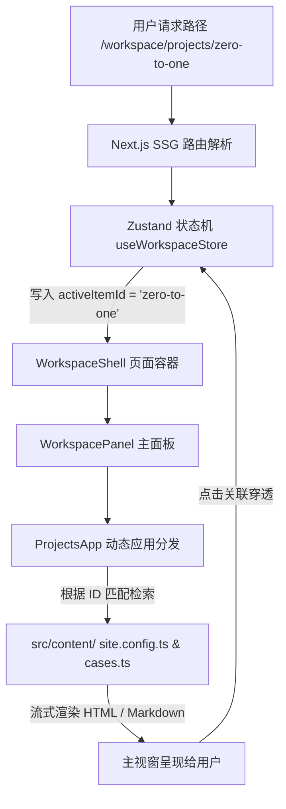

# Clancy Space — 个人系统化工作台模板 (Workspace Portfolio OS)

一个专为高阶 AI 产品经理与系统工程师打造的**高奢社论级 + 极客控制台**双模个人作品集网站模板。

---

## 1. 项目定位 (What is this?)

**Clancy Space** 是一个融合了 **Showcase（长滚动品牌展示首页）** 与 **Workspace OS（工作台控制系统）** 的个人系统化组合网站：
* **首页面板 (Showcase Mode)**：走大牌设计事务所、高雅社论动效风（Editorial Motion Luxury）。用于打造极致的个人专业品牌第一印象。
* **工作台系统 (Workspace OS Mode)**：模拟轻量化控制台操作系统，内嵌 **在线简历**、**项目库**、**深度案例拆解**、**系统方法论**及**实验室 Playground** 等模块。

---

## 2. 设计背景与痛点 (Project Background)

### 2.1 传统简历与作品集的痛点：
1. **体验断层与撕裂**：许多极客风的作品集为了追求“黑客帝国式 OS 模拟”，将所有内容强行塞入一个固定高度的“卡片伪窗口”中，导致页面内出现“多重滚动条嵌套”的硬伤，极大损伤了触控板和移动端的滑动体验。
2. **可读性灾难**：为了在深色模式下体现“精致感”，盲目使用超细字体（`font-light` / 300字重）和低对比度文字（`text-muted`），导致汉字多笔画晕染、发虚模糊，面试官阅读极为吃力。
3. **内容零散无逻辑**：项目、方法论、简历各板块各自为政，面试官无法将你的“项目实践”与你的“方法论思考”进行穿透式关联。

### 2.2 我们的解决方案：
* **原生滚动重构**：彻底废除伪窗口的高度束缚，恢复页面级原生视轨滚动，配合全局高精度 Lenis 滚轮引擎，体验极其丝滑。
* **暗黑模式汉字可读性优化**：全局清理了细体字，采用针对黑色背景优化的标准字重与高对比度文字等级，解决小字发虚、看不清的痛点。
* **ID 穿透关联网络**：建立关系网格。当面试官在阅读某个项目时，能一键穿透查阅该项目背后的**三权分立 CPA 架构**（方法论）和**避免 AI 过早输出 PRD**（深度案例分析）。

---

## 3. 我们具体做了什么 (Features & Core Capabilities)

* **6 大合一核心应用 (Consolidated Dock Apps)**：
  - 🏠 **Home (控制台主页)**：全局状态看板，展示当前构建、前沿探索和快捷操作。
  - 📄 **Resume (在线简历)**：Tab 切换“简历摘要”（支持一键打印/完美导出 PDF）与“关于我”（核心能力与工具箱）。
  - 📁 **Projects (精选项目)**：聚合展示“精选项目列表”与“结构化案例拆解 (Case Study)”。
  - 💡 **Thinking (思维与研究)**：整合“系统方法模型”与“研究随笔文章”（带前端实时标签搜索过滤）。
  - 🧪 **Lab (系统实验室)**：登记实验假设、验证数据与结论，展示 Hacker 动手实践力。
  - ✉️ **Contact (联系方式)**：集成邮箱一键复制、直邮链接及社媒网格。
* **PDF 一键完美净化打印**：隐藏所有背景粒子、动态圆环等装饰性 Canvas，即使从“关于我” Tab 打印，也会强制将简历格式规范输出，确保纸张简历无瑕疵。
* **SSG 与静态路径自愈**：支持完全静态导出（Static Export），并在 Next.js 路由上做了路径劫持自愈（例如旧路由 `/profile` 自动重定向至新版 `/resume/about`），确保部署在 GitHub Pages 或 Vercel 时 100% 零 404。

---

## 4. 系统架构设计 (System Architecture)

项目基于 **Next.js (App Router) + TypeScript + Tailwind CSS 4 + Zustand** 架构开发，数据与渲染层实现完全解耦：



---

## 5. 项目目录结构 (Directory Structure)

```text
├── src/
│   ├── app/                 # Next.js App Router 路由配置 (支持 SSG 预渲染路径)
│   ├── components/
│   │   ├── apps/            # 6 个核心控制台应用组件 (ResumeApp, ProjectsApp 等)
│   │   ├── layout/          # 导航栏、页脚等公共布局
│   │   ├── motion/          # Smooth Scroll 滚动提供者、Canvas 背景粒子与动态环
│   │   ├── sections/        # 首页（Showcase）的各个长滚动板块组件
│   │   └── workspace/       # 控制台外壳、Utility Bar 辅助栏、全局 Dock 栏及面板
│   ├── content/             # 核心静态内容数据库 (简历、项目、案例、实验室) 👈 修改内容在此！
│   └── store/               # Zustand 状态管理器 (管控应用打开、深度链接跳转、回滚栈)
├── public/                  # 静态资源、PDF 简历归档等
├── CONTENT_GUIDE.md         # 内容空缺修改指南手册 👈 详细修改说明！
└── README.md                # 本说明文件
```

---

## 6. 如何使用与修改内容 (Workflow & Content Customization)

### 6.1 快速内容修改路径
网站的所有具体内容都是通过静态文件驱动的。如果你想替换为自己的简历和项目，请参照根目录下的 **`CONTENT_GUIDE.md`** 指南。简要映射关系如下：

1. **基本信息与简历**：编辑 `src/content/profile.ts` 中的 `profileData`。
2. **精选项目列表**：编辑 `src/content/site.config.ts` 中的 `projects`。
3. **案例拆解**：编辑 `src/content/cases.ts` 中的 `caseStudies`。
4. **思维模型/随笔**：编辑 `src/content/thinking.ts` 和 `src/content/notes.ts`。
5. **实验原型**：编辑 `src/content/lab.ts` 中的 `labItems`。

---

### 6.2 本地运行与构建流程

#### 1. 安装依赖
```bash
npm install
```

#### 2. 本地开发调试
```bash
npm run dev
```
启动后，浏览器打开 [http://localhost:3000](http://localhost:3000) 即可进行实时热更新开发。

#### 3. 校验构建（发布前必备）
在提交或发布前，必须执行静态打包校验，确保没有任何 TypeScript 类型错误或 404 死链：
```bash
npm run build
```

#### 4. 提交并部署
本模板 100% 兼容静态导出（Static Export），你可以轻松一键免费部署至 **Vercel** 或 **GitHub Pages**。
```bash
git add .
git commit -m "content: customize with my personal resume and projects"
git push origin main
```
